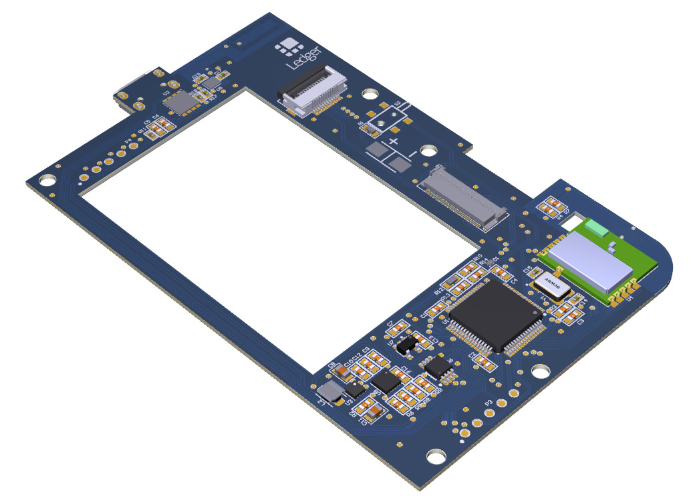
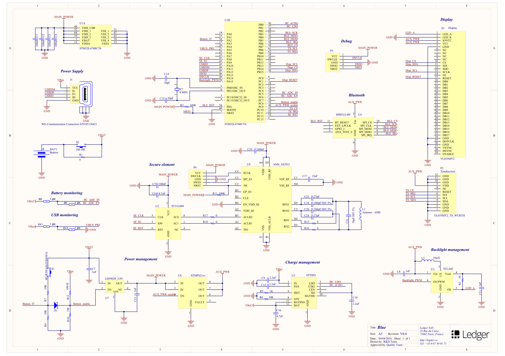
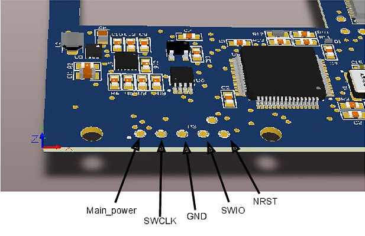

# Schematics & Assembly Ledger Blue Developer Edition

All necessary information regarding the schematics and PCB of the Ledger Blue Developer Edition are available in this repository.

Developers can use JTAG to debug code directly on the Non Secure microcontroller

 

Available files:

* [Schematics](schematics-v06.pdf)
* [Board in 3D](board-3d-v06.pdf)
* [PCB bottom layer](assembly-bottom-layer-v06.gbl)
* [PCB top layer](assembly-top-layer-v06.gtl)
* [PCB placement](assembly-drawings-v06.pdf)

## Bill of materials

| Designator | Quantity | Description | Manufacturer | Manufacturer Part Number |
|--------------------|----------|----------------------------------------------------------|--------------------|--------------------------|
| BAT1 | 1 | Battery holder | | Battery 34x50mm |
| C1, C2, C3, C4, C5 | 5 | Capacitor 0603 - 100nF - 16V - X7R - 10% | Yageo | CC0603KRX7R7BB104 |
| C6, C16 | 2 | Capacitor 0603 - 4.7uF - 10V - X5R - 10% | Murata | GRM188R61A475KE15D |
| C7, C13 | 2 | Capacitor 0603 - 1uF - 10V - X5R - 10% | Samsung | CL10A105KP8NNNC |
| C8, C11 | 2 | Capacitor 0805 - 1uF - 25V - X7R - 10% | AVX | 08053C105KAT2A |
| C9, C10, C12 | 3 | Capacitor 0603 - 2.2uF - 10V - X7R - 10% | Murata | GRM188R71A225KE15D |
| C14, C15 | 2 | Capacitor 0402 - 20pF - 50V - COG - 5% | Murata | GRM1555C1H200JA01D |
| C17 | 1 | Capacitor 0402 - 15nF - 50V - X7R - 10% | Murata | GRM155R71H153KA12D |
| C18, C20 | 2 | Capacitor 0402 - 180pF - 50V - COG - 5% | Murata | GRM1555C1H181JA01D |
| C19 | 1 | Capacitor 0402 - 100nF - 16V - X7R - 10% | Murata | GRM155R71C104KA88D |
| C21 | 1 | Capacitor 0402 - 39pF - 50V - COG - 5% | Murata | GRM1555C1H390JA01D |
| C23, C24 | 2 | Capacitor 0402 - 27pF - 50V - COG - 5% | Murata | GRM1555C1H270JA01D |
| D1 | 1 | Diode - Schottky - BAT30F3 | STMicroelectronics | BAT30F3 |
| J1 | 1 | Connector - USB - Micro B - Wurth | Wurth | 629-105-150-521 |
| L2 | 1 | Inductor 3012 - 10UH - 20% | TDK | VLF3012ST-100MR59 |
| P1 | 1 | Connector - Display - YL035MY2 | Hirose | FH23-39S-0.3SHW(05) |
| P2 | 1 | Connector - Touchscreen- YL035MY2 | Wurth | 687-112-149-022 |
| R1 | 1 | Resistor 0603 - 0Ohm - 0.1W - 1% | Vishay | CRCW06030000Z0EA |
| R2 | 1 | Resistor 0603 - 10Ohm - 0.1W - 1% | Vishay | CRCW060310R0FKEA |
| R3 | 1 | Resistor 0603 - 100KOhm - 0.1W - 1% | Yageo | RC0603FR-07100KL |
| R4, R6, R7 | 3 | Resistor 0603 - 10KOhm - 0.1W - 1% | Yageo | RC0603FR-0710KL |
| R5 | 1 | Resistor 0603 - 1KOhm - 0.1W - 1% | Yageo | RC0603FR-071KL |
| R8, R9, R13, R14 | 4 | Resistor 0603 - 1.2KOhm - 0.1W - 1% | Vishay | CRCW06031K20FKEA |
| R10 | 1 | Resistor 0603 - 1MOhm - 0.1W - 1% | Vishay | CRCW06031M00FKEA |
| R11 | 1 | Resistor 0402 - 100KOhm - 0.0625W - 1% | Vishay | CRCW0402100KFKED |
| R12 | 1 | Resistor 0603 - 680KOhm - 0.1W - 1% | Vishay | CRCW0603680KFKEA |
| R15, R16, R17, R18 | 4 | Resistor 0402 - 0Ohm - 0.0625W - 1% | Vishay | CRCW04020000Z0ED |
| S1 | 1 | Misc - Button - WURTH 436353045816 | Wurth | 436353045816 |
| S2 | 1 | Misc - Button - MCFTE-3C-V | Multicomp | MCFTE-3C-V |
| U1 | 1 | IC - GP micro - STM32L476RCT6 | STMicroelectronics | STM32L476RCT6 |
| U2 | 1 | IC - secure micro - ST31G480 | STMicroelectronics | ST31G480 |
| U3 | 1 | Power - Led driver - STLA02 - 27V - 500mW | STMicroelectronics | STLA02PUR |
| U4 | 1 | RF - IC - BLE - SPBTLE-RF | STMicroelectronics | SPBTLE-RF |
| U5 | 1 | Power - Battery charger - 200 mA - STNS01 | STMicroelectronics | STNS01PUR |
| U6 | 1 | Power - Switch - STMPS2151 - 500mA | STMicroelectronics | STMPS2151TTR |
| U7 | 1 | Power - LDO - 3.0V - 200 mA - SOT23 | STMicroelectronics | LD39020ADM30R |
| U8 | 1 | RF - IC - NFC - booster - AS3921 | AMS | AS3921 |
| Y1 | 1 | XTAL - 8MHZ - 10PF - 5 X 3.2MM - ABM3B-8.000MHZ-10-1-U-T | Abracon | ABM3B-8.000MHZ-10-1-U-T |
